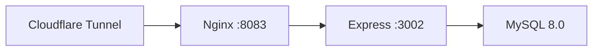

# 区队管理系统 · 项目全景说明

> 本文档面向 **接手该项目的工程师** 或 **需要全面了解项目的用户**。
> 项目由 AI 辅助开发而成，此文档基于代码现状（截至 2026-05-17 `99b803b` 提交）整理，作为唯一可靠的「权威现状」参考。
> 如果和其它旧文档有冲突，**以本文档为准**。

---

## 目录

1. [项目简介](#1-项目简介)
2. [技术栈](#2-技术栈)
3. [系统架构](#3-系统架构)
4. [目录结构](#4-目录结构)
5. [业务模块地图](#5-业务模块地图)
6. [前端工程解析](#6-前端工程解析)
7. [后端工程解析](#7-后端工程解析)
8. [权限模型](#8-权限模型)
9. [认证与登录流程](#9-认证与登录流程)
10. [数据库设计](#10-数据库设计)
11. [部署架构](#11-部署架构)
12. [本地开发指南](#12-本地开发指南)
13. [发版流程](#13-发版流程)
14. [历史遗留与已知债务](#14-历史遗留与已知债务)
15. [关键文件速查表](#15-关键文件速查表)

---

## 1. 项目简介

### 1.1 定位

**区队管理系统** 是一套面向**高校区队（即班级，军校体系下称为"区队"）**的综合管理应用。
典型用户：区队长、副区队长、团支书、委员、普通学员。

### 1.2 覆盖业务

18+ 个业务模块（按管理域划分）：

| 管理域 | 模块 |
|---|---|
| **学员生活** | 请假销假、作业管理、心理干预、意见反馈（匿名建议） |
| **组织建设** | 通知发布、公告资源、区队相册 |
| **财务管理** | 班费管理（收缴/申请/审批/公示/监督/报销/投票表决） |
| **氛围建设** | 擂台挑战、积分中心、积分排行、投票表决、抽奖活动 |
| **管理员工具** | 成员管理（`/admin/members`） |
| **系统功能** | 注册登录、个人中心、App 内更新检查 |

### 1.3 多端支持

| 端 | 支持度 | 说明 |
|---|---|---|
| **Android App** | ✅ 主力 | Capacitor 8 打包 APK，自助分发（CDN 下载） |
| **H5 / 浏览器** | ✅ 辅助 | SPA 模式，Nginx 静态托管 |
| **微信小程序** | ❌ 已移除 | 个人资质无法过审，相关代码已清理 |

### 1.4 为什么从小程序转到 Android App

微信小程序对「班级/团队管理」类应用要求**企业主体资质**审核，个人开发者无法通过。
因此项目整体脱离小程序发布路线，改走 Android APK **自助分发**（CDN 下载链接，不走应用商店）。

---

## 2. 技术栈

### 2.1 前端（`frontend-v3/`）

| 技术 | 版本 | 用途 |
|---|---|---|
| **Vue 3** | `3.5` | UI 框架，全项目用 Composition API + `<script setup>` |
| **TypeScript** | `^6.0.3` | 类型系统 |
| **Pinia** | `^2.3.1` | 全局状态管理，只有一个 store：`user` |
| **Vite** | `^6.4.2` | 构建工具 |
| **Vue Router** | `^4.6.4` | 路由管理（hash 模式） |
| **Capacitor** | `^8.3.4` | Android APK 打包 + 原生功能桥接 |

无外部 UI 组件库 — 所有组件自建（NavBar、TabBar 等）。

### 2.2 后端（`backend/`）

| 技术 | 版本 | 用途 |
|---|---|---|
| **Node.js** | 22 | 运行时 |
| **Express** | `^4.18.2` | Web 框架 |
| **MySQL 8.0** | 本地实例 | 数据库 |
| **mysql2** | `^3.6.5` | 数据库驱动（Promise + 连接池，connectionLimit=10） |
| **jsonwebtoken** | `^9.0.2` | JWT 认证，24h 有效期 |
| **bcryptjs** | `^3.0.3` | 密码哈希 |
| **helmet** | `^7.1.0` | HTTP 安全头 |
| **express-rate-limit** | `^6.9.0` | 速率限制 (15 分钟 600 次) |
| **multer** | `^1.4.5-lts.1` | 文件上传 |
| **axios** | `^1.6.0` | 外部 HTTP 调用 |

### 2.3 构建和打包

| 场景 | 命令 / 工具 |
|---|---|
| 开发调试 | `cd frontend-v3 && npm run dev`（Vite HMR） |
| 生产构建 | `cd frontend-v3 && npm run build` → 产物 `frontend-v3/dist/` |
| App 打包 | `npx cap sync android` + Android Studio 构建 APK |
| 后端运行 | `cd backend && node app.js` (或 systemd 托管) |

---

## 3. 系统架构

### 3.1 整体拓扑

```
┌───────────────────────────────────────────────────────────────┐
│              客户端（Vue 3 SPA，Capacitor WebView / 浏览器）   │
│  ┌──────────┐              ┌──────────┐                      │
│  │ Android  │              │   H5     │                      │
│  │   APK    │              │ (Web)    │                      │
│  └────┬─────┘              └─────┬────┘                      │
│       └──────────┬───────────────┘                            │
│                  │                                             │
│      ┌───────────┴──────────┐                                 │
│      │  utils/request.ts    │  fetch + JWT 自动注入           │
│      └───────────┬──────────┘                                 │
│                  │ Authorization: Bearer <JWT>                 │
└──────────────────┼────────────────────────────────────────────┘
                   │ HTTPS
                   ▼
┌──────────────────────────────────────────────────────────────┐
│            Cloudflare Tunnel (HTTPS 终端 + CDN)               │
└──────────────────────────┬───────────────────────────────────┘
                           │ :443
                           ▼
┌──────────────────────────────────────────────────────────────┐
│              Nginx :8083（反向代理 + 动静分离）                │
│   /api/* → 127.0.0.1:3002     /assets/* → 缓存 30d           │
│   SPA fallback → index.html                                   │
└──────────────────────────┬───────────────────────────────────┘
                           │ :3002
                           ▼
┌──────────────────────────────────────────────────────────────┐
│          Express :3002（systemd 托管，本地运行）               │
│  middleware: helmet → cors → body-parser → rate-limit         │
│            → operationLog（写操作全部落库）→ JWT auth         │
│  18 个路由模块 → 16 个控制器 → 21 个模型                      │
└──────────────────────────┬───────────────────────────────────┘
                           │ SQL
                           ▼
┌──────────────────────────────────────────────────────────────┐
│           MySQL 8.0（本地实例，31 张表 + 2 视图）              │
│  连接池：mysql2 promisePool (connectionLimit=10)              │
└──────────────────────────────────────────────────────────────┘
```

### 3.2 认证架构

系统使用**自签 JWT 认证**：

1. 用户通过学号+密码 / 手机号+验证码 / 邮箱+验证码登录
2. 后端 `AuthController` 验证凭据 → 签发 JWT（24h 有效期）
3. JWT payload：`{ id, openid, role, isAdmin }`
4. 前端 `request.ts` 自动在每次请求附加 `Authorization: Bearer <JWT>`
5. 后端 `middleware/auth.js` 校验 JWT + 角色权限

注册流程：用户提交学号/姓名/班级/角色等信息 → `POST /api/auth/register` → 直接获得 JWT。

---

## 4. 目录结构

```
class_manage_sys/
├── frontend-v3/                         # 前端源码 (Vue 3 + Vite + Capacitor)
│   ├── src/
│   │   ├── api/                         # API 接口层（19 个模块，每个对应一个后端路由）
│   │   │   ├── index.ts                 # 统一 re-export
│   │   │   ├── auth.ts                  # 登录/注册/密码/验证码
│   │   │   ├── user.ts                  # 用户 CRUD
│   │   │   ├── leave.ts / notice.ts / fee.ts / ...
│   │   │   └── admin.ts
│   │   ├── components/
│   │   │   ├── ui/                      # NavBar.vue / TabBar.vue
│   │   │   └── business/               # （预留）业务组件
│   │   ├── router/
│   │   │   └── index.ts                 # 【核心】路由定义 + 导航守卫 (beforeEach)
│   │   ├── stores/
│   │   │   └── user.ts                  # 【核心】Pinia store，用户信息 + token
│   │   ├── types/
│   │   │   └── roles.ts                # 【核心】角色/权限矩阵定义（前后端统一编码）
│   │   ├── pages/                       # 页面（44 个 .vue 文件）
│   │   │   ├── index/                   # 首页（主入口）
│   │   │   ├── login/                   # 登录（3 种方式）
│   │   │   ├── notice/                  # 通知（列表/详情/管理）
│   │   │   ├── leave/                   # 请假（列表/申请/详情/审批）
│   │   │   ├── fee/                     # 班费（首页/申请/详情/审批）
│   │   │   ├── homework/                # 作业（列表/详情）
│   │   │   ├── announcement/            # 公告（列表/详情/管理）
│   │   │   ├── album/                   # 相册（列表/详情）
│   │   │   ├── vote/                    # 投票（列表/详情/管理）
│   │   │   ├── lottery/                 # 抽奖（列表/详情/管理）
│   │   │   ├── challenge/              # 擂台（列表/详情/管理）
│   │   │   ├── psychological/          # 心理（首页）
│   │   │   ├── suggestion/             # 建议（首页/收件箱）
│   │   │   ├── points/                 # 积分（首页/管理）
│   │   │   ├── profile/                # 个人中心（首页/设置/关于）
│   │   │   ├── admin/                  # 管理员（成员列表/详情）
│   │   │   ├── dashboard/              # 仪表盘
│   │   │   ├── features/               # 功能矩阵
│   │   │   └── stub/                   # 占位组件
│   │   ├── layouts/
│   │   │   └── default.vue
│   │   ├── composables/                # 组合式函数
│   │   ├── utils/
│   │   │   ├── request.ts              # HTTP 封装（fetch + 401/403 拦截）
│   │   │   ├── ui.ts                   # toast/confirm 封装
│   │   │   ├── avatar.ts              # 头像工具
│   │   │   └── sanitize.ts            # XSS 防注入
│   │   ├── styles/
│   │   │   └── variables.css           # CSS 自定义属性（双主题色板）
│   │   ├── App.vue                     # 根组件（TabBar 显隐 + 登录状态监听）
│   │   └── main.ts                     # 入口（创建 Vue + Pinia + Router）
│   ├── capacitor.config.ts             # Capacitor 配置
│   ├── vite.config.ts                  # Vite 配置（含 /api proxy → 3002）
│   ├── tsconfig.json
│   ├── index.html
│   └── package.json
│
├── backend/                             # 后端源码 (Express + MySQL)
│   ├── config/
│   │   ├── database.js                  # MySQL 连接池
│   │   └── multer.js                   # 文件上传配置
│   ├── middleware/
│   │   ├── auth.js                      # JWT 验证中间件 + authorizeAdmin/authorizeRole
│   │   └── operationLog.js              # 写操作日志中间件（对业务透明）
│   ├── controllers/                     # 16 个控制器（处理请求 + 响应）
│   ├── models/                          # 21 个模型（手写 SQL 参数化查询）
│   ├── routes/                          # 18 个路由文件
│   ├── shared/
│   │   └── constants.js                 # 【核心】角色常量（前后端统一编码）
│   ├── data/
│   │   └── app-version.json             # App 版本元数据（发版时改这个）
│   ├── app.js                           # Express 入口
│   ├── database_init.sql                # 数据库建表脚本（31 张表 + 2 视图）
│   ├── Dockerfile                       # 容器镜像构建
│   └── package.json
│
├── docs/                                # 项目文档
│   ├── PROJECT_OVERVIEW.md              # 本文档
│   ├── SYSTEM_ARCHITECTURE.md           # 目标架构设计
│   └── MIGRATION_PLAN.md                # uni-app→Vue3 迁移计划（已完成）
│
├── nginx-cls.conf                       # Nginx 配置（生产环境）
├── .env.development / .env.production   # 环境变量
├── .hermes/                             # AI 工程上下文
└── standards/                           # 通用项目规范
```

---

## 5. 业务模块地图

### 5.1 模块 × 接口 × 页面对照表

| 模块 | 前端 API | 后端路由 | 主要页面 | 核心权限 |
|---|---|---|---|---|
| **认证** | `api/auth.ts` | `/api/auth` | `login/*` | 公开 |
| **用户** | `api/user.ts` | `/api/users` | `profile/index` | 自己或管理员 |
| **请假** | `api/leave.ts` | `/api/leave` | `leave/{index,apply,detail,approvals}` | 全员申请 / 干部审批 |
| **通知** | `api/notice.ts` | `/api/notice` | `notice/{index,detail,admin}` | 全员阅读 / 干部发布 |
| **公告** | `api/announcement.ts` | `/api/announcement` | `announcement/{index,detail,admin}` | 全员看 / 区队长发 |
| **相册** | `api/album.ts` | `/api/album` | `album/{index,detail}` | 全员看 / 干部管 |
| **班费** | `api/fee.ts` | `/api/fee` | `fee/{index,expense-apply,expense-detail,approvals}` | 干部分工细粒度权限 |
| **作业** | `api/homework.ts` | `/api/homework` | `homework/{index,detail}` | 全员看 / 学习副区发 |
| **心理** | `api/psychological.ts` | `/api/psychological` | `psychological/index` | 全员申请 / 心理副区处理 |
| **擂台挑战** | `api/challenge.ts` | `/api/challenge` | `challenge/{index,detail,manage}` | 全员参与 |
| **投票** | `api/vote.ts` | `/api/vote` | `vote/{index,detail,manage}` | 全员投票 / 干部发起 |
| **建议箱** | `api/suggestion.ts` | `/api/suggestion` | `suggestion/{index,inbox}` | 全员匿名提 / 干部处理 |
| **抽奖** | `api/lottery.ts` | `/api/lottery` | `lottery/{index,detail,manage}` | 全员参与 |
| **积分** | `api/points.ts` | `/api/points` | `points/{index,manage}` | 全员查 |
| **班级** | `api/classes.ts` | `/api/classes` | （辅助注册） | 查询 |
| **消息** | `api/message.ts` | `/api/message` | （嵌入其它页面） | 个人 |
| **管理员** | `api/admin.ts` | `/api/admin` | `admin/{members,member-detail}` | 仅管理员 |
| **App 更新** | `api/app.ts` | `/api/app` | 嵌入 profile | 公开 |

### 5.2 页面数量统计

- **页面总数**：44 个 `.vue` 文件（Router 注册 43 个 + 1 个占位组件）
- **登录注册**：3 页（密码/手机/邮箱）
- **管理员页面**：2 页（成员列表/成员详情）+ 管理后台 4 页

---

## 6. 前端工程解析

### 6.1 分层架构

```
Page (.vue)           ← 用户交互层
  │
  ▼
Pinia Store           ← 全局状态（仅 user）
  │
  ▼
API 层 (src/api/*)    ← 业务接口封装（纯函数，一个文件对应一个后端路由模块）
  │
  ▼
request.ts            ← HTTP 请求基础层（fetch 封装 + 401 拦截 + JWT 自动注入）
  │
  ▼
后端 REST API
```

### 6.2 核心工具文件职责

#### `utils/request.ts`

- 对 `fetch` 的封装
- 自动附加 `Authorization: Bearer <JWT>` 头
- 401 自动清 token + 跳登录页（仅跳一次，防循环）
- 403 抛 `ApiError`（业务可 `silent` 吞掉）
- 4xx/5xx 默认 toast 提示
- 支持 `silent` 选项（静默不 toast）
- `VITE_API_BASE_URL` 未配置时明确报错
- 提供 `uploadFile()` 方法（multipart/form-data）

#### `stores/user.ts`

全局唯一 Pinia store，管理：
- `profile: UserProfile | null` - 当前用户完整信息
- `isAuthenticated` / `role` / `isAdmin` / `roleLabel` - 衍生状态
- `hydrate()` - 同步从 localStorage 恢复
- `setProfile(p)` / `setTokenAndProfile(token, p)` - 设置
- `refresh()` - 异步拉 `/api/auth/userinfo` 更新
- `logout()` - 清空所有本地状态
- `hasPermission(perm)` / `isRoleOneOf(targets)` - 权限判断

#### `router/index.ts`

- 使用 `createWebHashHistory`（SPA 兼容）
- 全局 `beforeEach` 守卫：
  - 公开路由（登录 3 页）放行
  - 无 token → 跳密码登录页
  - 无 profile → 清 token 跳登录
  - `meta.requiresAdmin` → 非管理员跳首页

#### `types/roles.ts`

10 种角色定义 + `PERMISSIONS` 矩阵（15 条权限规则），前后端编码一致。

---

## 7. 后端工程解析

### 7.1 分层架构（MVC 风格）

```
Express App (app.js)
  │
  ▼
middleware (helmet/cors/rate-limit/bodyparser/operationLog/auth)
  │
  ▼
routes/*.js (18 个，每个对应 /api/<module>)
  │
  ▼
controllers/*.js (16 个，处理 req/res + 调 model)
  │
  ▼
models/*.js (21 个，封装 SQL 查询)
  │
  ▼
config/database.js (mysql2 promisePool)
```

### 7.2 文件对应关系

| 路由 | 控制器 | 主要模型 | 端点数 |
|---|---|---|---|
| `routes/auth.js` | `AuthController` | `User` | 15 |
| `routes/fee.js` | `FeeController` | `Fee`, `FeeCollection`, `ExpenseApproval`, `FeePublication` | 25 |
| `routes/album.js` | `AlbumController` | `Album`, `Photo` | 9 |
| `routes/notice.js` | `NoticeController` | `Notice` | 9 |
| `routes/challenge.js` | `ChallengeController` | `Challenge` | 8 |
| `routes/leave.js` | `LeaveController` | `Leave` | 7 |
| `routes/announcement.js` | `AnnouncementController` | `Announcement`, `Resource` | 7 |
| `routes/homework.js` | `HomeworkController` | `Homework` | 7 |
| `routes/lottery.js` | `LotteryController` | `Lottery` | 6 |
| `routes/psychological.js` | `PsychologicalController` | `Psychological` | 5 |
| `routes/suggestion.js` | `SuggestionController` | `Suggestion` | 5 |
| `routes/vote.js` | `VoteController` | `Vote` | 5 |
| `routes/points.js` | `PointsController` | `Points` | 5 |
| `routes/users.js` | `AuthController` | `User` | 4 |
| `routes/admin.js` | `AdminController` | 多表 | 3 |
| `routes/message.js` | `MessageController` | `Message` | 3 |
| `routes/classes.js` | `ClassController` | `ClassInfo` | 2 |
| `routes/app.js` | （无 controller） | - | 1 |

合计 **126 个 HTTP 端点**。

### 7.3 关键中间件

#### `middleware/auth.js`

三个守卫函数：
- `authenticateToken` - 校验 JWT，注入 `req.user`
- `authorizeAdmin` - 要求 `req.user.role` 属于干部角色（1-9）
- `authorizeRole(role)` - 要求特定角色 ID

统一响应格式：所有错误含 `{ success: false, error: "..." }`。

#### `middleware/operationLog.js`

**特色设计：对业务无感知的操作审计**

- 接管 `res.json`，在响应前落库一条 `operation_logs` 记录
- 只记录写操作（POST/PUT/DELETE）
- 自动推断 `resource_type` 和 `action`
- 自动脱敏：`password / token / secret` 字段替换为 `***`
- 写日志失败 **不影响响应**

### 7.4 JWT 结构

```js
jwt.sign({
  id: user.id,              // 后端 user.id（数字）
  openid: user.openid,
  role: user.role,           // INT 0-9
  isAdmin: user.role > 0     // 冗余字段，方便中间件快速判断
}, JWT_SECRET, { expiresIn: '24h' });
```

### 7.5 数据库访问模式

项目**没有用 ORM**，所有查询是手写 SQL 参数化查询，例如：

```js
static async findByOpenid(openid) {
  const [rows] = await db.query(
    'SELECT * FROM users WHERE openid = ?',
    [openid]
  );
  return rows[0] || null;
}
```

---

## 8. 权限模型

### 8.1 角色定义（10 种）

定义在 `frontend-v3/src/types/roles.ts` 和 `backend/shared/constants.js`：

| INT | 角色 | 英文 Key | 说明 |
|:-:|---|---|---|
| 0 | 学员 | `STUDENT` | 普通用户 |
| 1 | 区队长 | `CLASS_LEADER` | 全局管理员，类似班长 |
| 2 | 生活副区 | `LIFE_VICE` | 管班费收缴 |
| 3 | 学习副区 | `STUDY_VICE` | 发作业 |
| 4 | 心理副区 | `PSYCHOLOGICAL_VICE` | 处理心理干预 |
| 5 | 团支书 | `LEAGUE_SECRETARY` | 组织建设 |
| 6 | 组织委员 | `ORGANIZATION_COMMITTEE` | 班费记账/公示 |
| 7 | 宣传委员 | `PUBLICITY_COMMITTEE` | 宣传管理 |
| 8 | 系统管理员 | `SUPER_ADMIN` | 超级权限 |
| 9 | 辅导员 | `COUNSELOR` | 审批+监督 |

### 8.2 双通道控制

```
前端（路由守卫 + v-if）── 仅 UI 优化，不可替代后端
后端（JWT middleware + Controller 检查）── 真正的安全屏障
```

`ADMIN_ROLE_IDS` = [1, 2, 3, 4, 5, 6, 7, 8, 9] — 角色 1-9 均视为"干部"。

### 8.3 权限矩阵（15 条规则）

| 权限 Key | 允许角色 | 说明 |
|-----------|----------|------|
| `ACCESS_DASHBOARD` | 1-9 | 班级仪表盘 |
| `PUBLISH_NOTICE` | 1-9 | 发布通知 |
| `PUBLISH_ANNOUNCEMENT` | 1, 8 | 发布公告 |
| `APPROVE_LEAVE` | 1-9 | 审批请假 |
| `COLLECT_FEE` | 2, 8 | 收缴班费 |
| `BOOKKEEP_FEE` | 6, 8 | 记账/公示 |
| `APPROVE_FEE_USE` | 1-9 | 审批班费使用 |
| `PUBLISH_HOMEWORK` | 3, 8 | 发布作业 |
| `HANDLE_PSYCHOLOGICAL` | 4, 8 | 处理心理申请 |
| `CREATE_VOTE` | 1-9 | 创建投票 |
| `CREATE_LOTTERY` | 1-9 | 创建抽奖 |
| `HANDLE_SUGGESTION` | 1-9 | 处理建议 |
| `MANAGE_ALBUM` | 1-9 | 管理相册 |
| `APPROVE_PHOTO` | 1-9 | 审批照片 |
| `UPLOAD_RESOURCE` | 1-9 | 上传资源 |

---

## 9. 认证与登录流程

### 9.1 支持的登录方式

| 方式 | 端点 | 说明 |
|---|---|---|
| 学号+密码 | `POST /api/auth/login-with-password` | 主推方式 |
| 手机号+密码 | `POST /api/auth/login-with-phone` | |
| 邮箱+密码 | `POST /api/auth/login-with-email` | |
| 手机号+验证码 | `POST /api/auth/phone-code-login` | 需先调 send-code |
| 邮箱+验证码 | `POST /api/auth/email-code-login` | 需先调 send-code |
| 注册 | `POST /api/auth/register` | 学号+姓名+班级+角色 |

### 9.2 登录→鉴权流程

```
1. 用户输入凭据 → POST /api/auth/login-with-password
2. 后端验证 → 签发 JWT（24h）
3. 前端 setToken() → localStorage
4. 后续所有请求自动带 Authorization: Bearer <JWT>
5. 路由守卫每次导航检查 token 和 user_profile
6. 401 → 清 token + 跳登录页
```

---

## 10. 数据库设计

### 10.1 表清单（31 张表 + 2 视图）

**核心业务表（22 张）**：`users`, `classes`, `leaves`, `notices`, `notice_reads`, `notice_completions`, `announcements`, `resources`, `albums`, `photos`, `messages`, `expenses`, `homeworks`, `homework_submissions`, `psychological_applications`, `challenges`, `challenge_applications`, `challenge_records`, `votes`, `vote_options`, `vote_records`, `suggestions`

**班费扩展表（5 张）**：`fee_collections`, `fee_collection_records`, `expense_approvals`, `expense_approval_votes`, `fee_publications`

**积分/抽奖/日志（3 张）**：`points`, `lotteries`, `lottery_participants`

**系统表（1 张）**：`operation_logs`

**视图（2 个）**：`user_stats`, `fee_summary`

### 10.2 班费审批流（最复杂业务）

三级金额阈值：
- **≤100 元**：区队长审批即过
- **100-500 元**：区队长 → 辅导员 两人审批
- **>500 元**：区队长 → 辅导员 → 全员匿名投票（多数同意通过）

审批流状态机实现在 `FeeController` 中，通过 `expense_approvals` 表跟踪每步审批节点。

---

## 11. 部署架构

### 11.1 当前部署

**生产环境**：本地服务器 → Cloudflare Tunnel → 公网 HTTPS



**关键配置**：

| 组件 | 位置 | 说明 |
|---|---|---|
| Nginx | `/etc/nginx/sites-enabled/` | `nginx-cls.conf` — 反向代理 + 缓存策略 |
| Express | systemd 托管 | `cd backend && node app.js` |
| MySQL | 本地实例 | `DB_HOST=127.0.0.1`, `DB_PORT=3306` |
| 域名 | `cls.ayinserver.xin` | CF Tunnel 映射到本地 :8083 |

**Nginx 缓存策略**：
- `/assets/*` → `Cache-Control: public, immutable` (30d)
- `/api/*` → `Cache-Control: no-store`
- `/uploads/*` → `Cache-Control: public` (7d)
- `/apk/*` → `Cache-Control: public` (1d)

### 11.2 CI/CD

GitHub Actions self-hosted runner：
1. `git pull` on main
2. `cd frontend-v3 && npm install && npm run build`
3. `systemctl restart class-manage`

---

## 12. 本地开发指南

### 12.1 后端

```bash
cd backend
cp .env.example .env  # 或已有 .env
# 确保 MySQL 运行且 database_init.sql 已执行
npm install
npm run dev  # nodemon 热重载
```

后端默认运行在 `http://localhost:3002`。

### 12.2 前端

```bash
cd frontend-v3
npm install
npm run dev  # Vite HMR，默认 :5173
```

Vite 配置了 proxy：`/api` → `http://localhost:3002`。开发时前端可直接同域请求后端。

### 12.3 数据库

```bash
mysql -u root -p < backend/database_init.sql
```

---

## 13. 发版流程

### 13.1 H5 部署

```bash
cd frontend-v3
npm run build          # 产物 → dist/
# CI 自动重启服务，或手动：
sudo systemctl restart class-manage
```

### 13.2 APK 打包

```bash
cd frontend-v3
npm run build
npx cap sync android
# 在 Android Studio 中打开 android/ 目录构建 APK
```

APK 产物放到 `backend/apk/` 目录，配合 `data/app-version.json` 实现 App 内更新检查。

---

## 14. 历史遗留与已知债务

### 14.1 已知问题

1. **响应格式不一致**：部分 controller 返回 `{ error }` 缺少 `success: false` 字段
2. **创建资源 ID key 不统一**：`leaveId` / `noticeId` / `expenseId` / `id` 混用
3. **列表数据 key 不统一**：`leaves` / `expenses` / `albums` / `items` 混用
4. **无自动化测试**：无 lint / typecheck / unit test
5. **用户头像**：`avatarUrl` 字段存在但头像上传功能未实现

### 14.2 历史清理

- ✅ 旧 `src/` (uni-app) 前端已移除
- ✅ `android/` Capacitor 原生项目目录已清理（根级，每次 `npx cap sync` 重建）
- ✅ 微信小程序相关代码已清理
- ✅ CloudBase SDK 依赖已移除
- ✅ 根目录遗留文件已清理（`README.md`、`PRD.md`、`CODEBUDDY.md`、`claude.py`、`cloudbaserc.json`）

---

## 15. 关键文件速查表

| 文件 | 用途 |
|---|---|
| `frontend-v3/src/router/index.ts` | 全部页面路由 + 导航守卫 |
| `frontend-v3/src/types/roles.ts` | **角色/权限唯一真相**（前端侧） |
| `frontend-v3/src/stores/user.ts` | 用户状态管理 |
| `frontend-v3/src/utils/request.ts` | HTTP 请求基础层 |
| `backend/shared/constants.js` | **角色/权限唯一真相**（后端侧） |
| `backend/middleware/auth.js` | JWT 验证 + 角色授权 |
| `backend/middleware/operationLog.js` | 写操作透明审计 |
| `backend/database_init.sql` | 数据库完整结构（31 表 + 2 视图） |
| `backend/app.js` | Express 入口 + 中间件链 |
| `nginx-cls.conf` | Nginx 生产配置 |

---

_最后更新：2026-05-17 · 对应提交 `99b803b`_

---

## 附录 · AI 协作约定

本项目由 AI 辅助开发，为确保后续协作一致性：

1. **"现状唯一真相"** - 本文档、`database_init.sql`、代码本身 是现状的唯一真相
2. **提交前必 `build`** - 任何代码改动提交前应 `cd frontend-v3 && npm run build` + `cd backend && node -c app.js` 验证编译通过
3. **权限判断走矩阵** - 新增权限能力加到 `PERMISSIONS` 对象，不要直接写 `role === 2`
4. **前后端常量对齐** - 角色编码修改必须同步更新 `types/roles.ts` 和 `shared/constants.js`
5. **文档与代码同步** - 改了架构类的东西要回来更新这份 `PROJECT_OVERVIEW.md`
