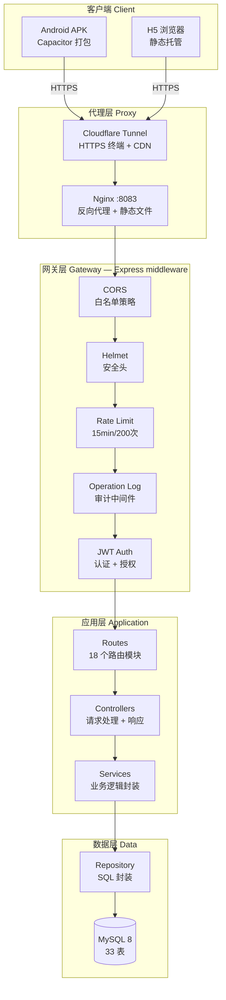
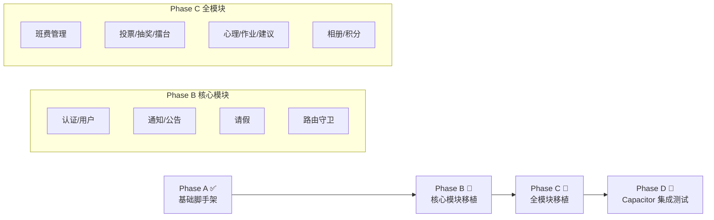
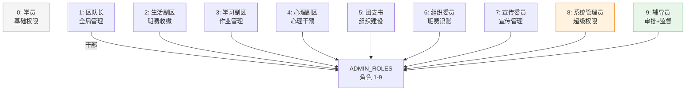
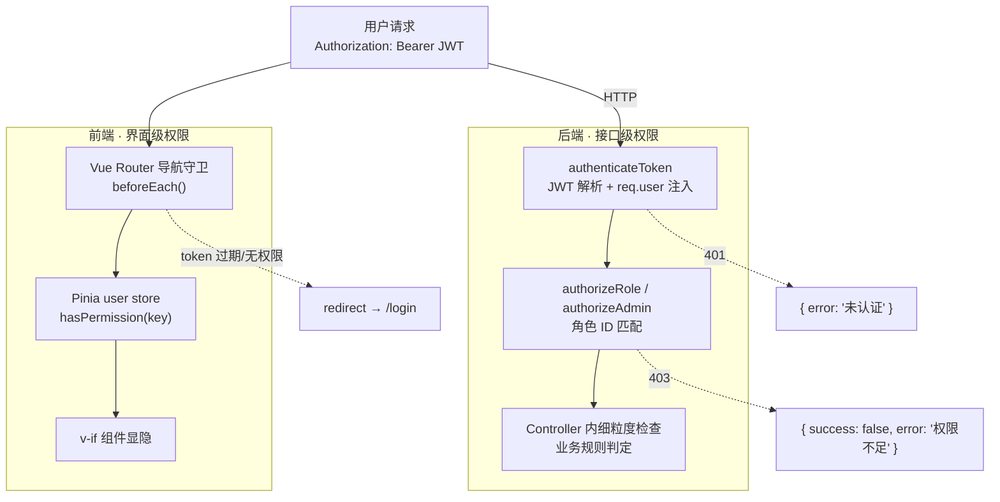
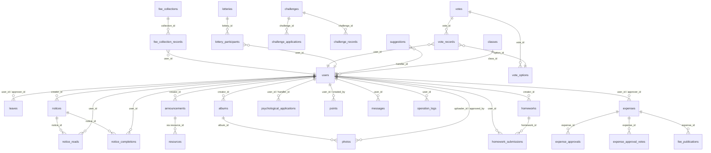
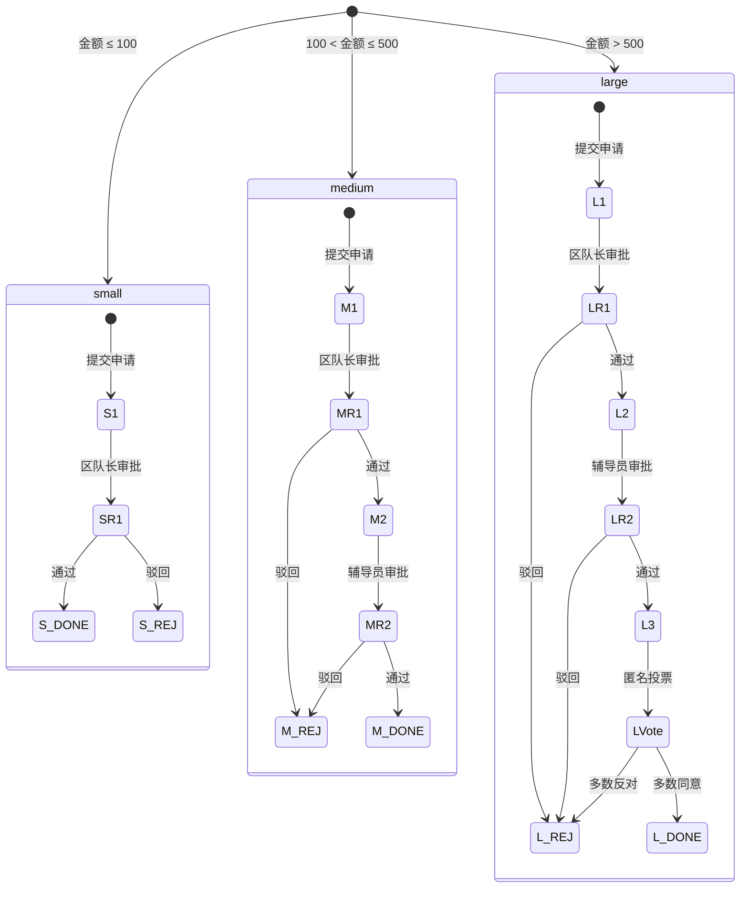
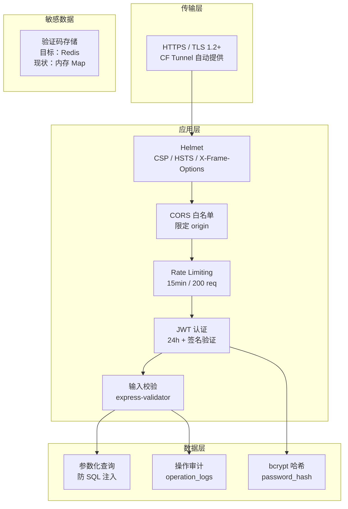
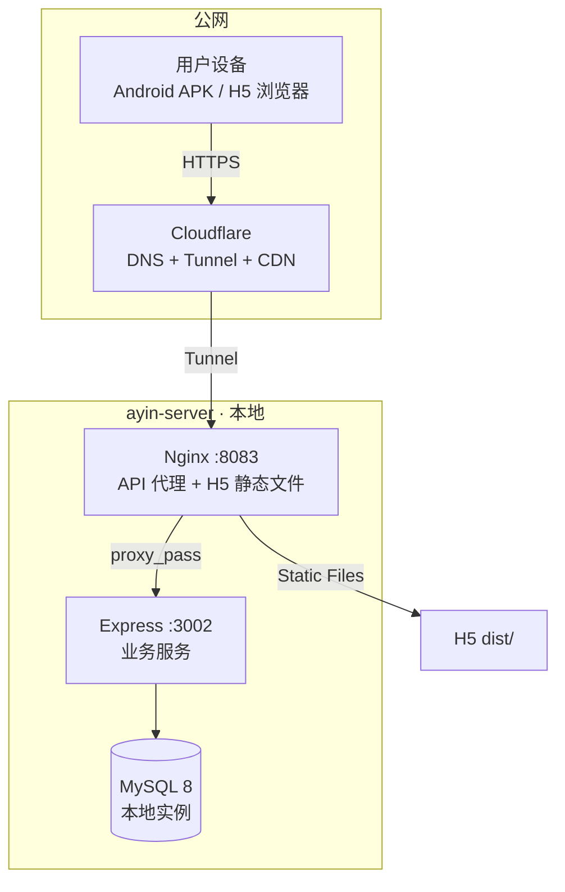
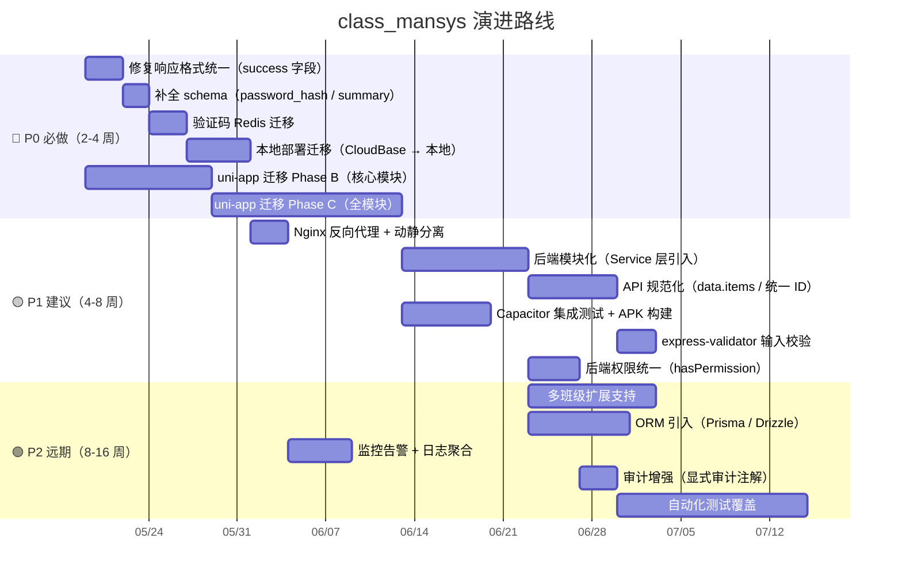

# 系统架构规范 — class_mansys

> **版本**: v2.0  
> **日期**: 2026-05-17  
> **状态**: 基于代码审计与项目全景的完整架构设计  
> **前置阅读**: `PROJECT_OVERVIEW.md`（项目现状）→ `PROJECT_INFO_AUDIT.md`（审计报告）→ 本文档（目标架构）

---

## 目录

1. [系统定位与约束](#1-系统定位与约束)
2. [分层架构](#2-分层架构)
3. [模块化设计](#3-模块化设计)
4. [权限模型](#4-权限模型)
5. [API 规范](#5-api-规范)
6. [数据库设计](#6-数据库设计)
7. [安全设计](#7-安全设计)
8. [部署架构](#8-部署架构)
9. [演进路线](#9-演进路线)
10. [附录：参考架构与关键决策](#10-附录参考架构与关键决策)

---

## 1. 系统定位与约束

### 1.1 系统定位

**class_mansys** — 面向公安大学区队级（38 人）的综合管理应用。覆盖 18 个业务模块：学员生活（请假/作业/心理）、组织建设（通知/公告/相册）、财务管理（班费收缴/审批/公示）、氛围建设（投票/抽奖/擂台/积分）、管理员工具（成员管理）。

| 维度 | 约束 |
|------|------|
| 用户规模 | 38 人（单班级），峰值并发 < 50 |
| 运维人 | 1 人（学生自行运维） |
| 数据量级 | 百条/天注册，千条/天日志 |
| 合规要求 | 公安院校背景，公网访问需安全加固 |
| 多端支持 | Android APK（主力）+ H5 浏览器（辅助） |
| 扩展性 | 预留多班级扩展（当前 6 个班级硬编码） |

### 1.2 技术栈（目标）

| 层 | 技术 | 版本/说明 |
|----|------|-----------|
| **前端** | Vue 3 (Composition API) + TypeScript | `^3.5.13` |
| | Vite | 构建工具 |
| | Vue Router 4 | 路由管理 |
| | Pinia | 状态管理 |
| | Capacitor 8 | Android APK 打包 |
| | Axios | HTTP 请求封装 |
| **后端** | Express.js | Node.js Web 框架 |
| | MySQL 8 | 数据库 |
| | JWT (jsonwebtoken) | 认证，24h 有效期 |
| | bcryptjs | 密码哈希 |
| | Helmet | HTTP 安全头 |
| **基础设施** | Cloudflare Tunnel | 公网穿透 |
| | Nginx | 反向代理 (:8083) |
| | 本地部署 | 后端 localhost:3002 |

---

## 2. 分层架构

### 2.1 目标架构全景



### 2.2 现状 vs 目标

| 层次 | 现状 | 目标 | 优先级 |
|------|------|------|--------|
| 表现层 | uni-app（300+ 处 `uni.xxx()`），`pages.json` 路由 | Vue 3 + Vite + Vue Router + Capacitor | **P0** |
| 代理层 | CF Tunnel 直连 Express | CF Tunnel → Nginx → Express（动静分离、缓存策略） | **P1** |
| 网关层 | CORS / Helmet / rate-limit / operationLog / auth | ✅ 基本到位，需修复响应格式不一致 | **P0** |
| 应用层 | Controller 直接调 Model（扁平 MVC），无 Service 层 | Routes → Controller → Service → Repository | **P1** |
| 数据层 | 手写 SQL（无 ORM），连接池 10 | Repository 模式封装，连接池根据并发调优 | **P2** |

**工作量估计**: 迁移前端 Phase B-D 约 25-30 工程天，后端重构约 10-15 工程天，总计 **35-45 工程天**。

### 2.3 中间件执行链

顺序即语义——不可调整：

```
helmet → cors → body-parser(json) → body-parser(urlencoded)
→ static(/uploads,/apk) → rate-limit(/api) → operationLog
→ authenticateToken → authorizeAdmin/authorizeRole → route handler
```

关键约束：`rate-limit` 仅作用于 `/api` 路径，不影响静态资源。`operationLog` 劫持 `res.json` 实现透明审计，必须在路由之前挂载，在 `authenticateToken` 之后执行时才能拿到 `req.user`。

---

## 3. 模块化设计

### 3.1 后端模块结构（目标）

每个业务模块自包含，统一的文件夹/文件约定：

```
backend/
├── modules/
│   ├── auth/
│   │   ├── routes.js
│   │   ├── controller.js
│   │   ├── service.js
│   │   ├── repository.js
│   │   └── __tests__/
│   ├── leave/
│   ├── notice/
│   ├── announcement/
│   ├── fee/             ← 最复杂模块（10+端点、三级审批流）
│   ├── homework/
│   ├── psychological/
│   ├── challenge/
│   ├── vote/
│   ├── suggestion/
│   ├── lottery/
│   ├── points/
│   ├── album/
│   ├── class/
│   ├── message/
│   └── admin/
├── shared/
│   ├── constants.js      ← 角色/权限常量（单点真相）
│   ├── middleware/
│   ├── response.js       ← 统一响应工具
│   └── errors.js         ← 自定义错误类
├── config/
│   └── database.js
├── app.js
└── database_init.sql
```

**模块内文件职责**：

| 文件 | 职责 | 示例 |
|------|------|------|
| `routes.js` | URL → Handler 映射 + 中间件挂载 | `router.post('/apply', authenticateToken, ctrl.apply)` |
| `controller.js` | 解析 req → 调 service → 格式化 res | `FeeController.createCollection` |
| `service.js` | 纯业务逻辑（权限判定、状态机、事务编排） | `FeeService.createCollection()` — 校验角色、创建批次、初始化全班记录 |
| `repository.js` | 数据访问封装（单一数据源） | `FeeRepository.findCollectionsBySemester(semester)` |
| `__tests__/` | 模块级单元测试 | Jest / Vitest |

### 3.2 前端模块结构（目标）

```
class-mansys-v2/
├── src/
│   ├── api/               ← API 封装（每个模块一个文件，映射后端 routes）
│   │   ├── client.ts      ← axios 实例 + 拦截器（401/403 处理）
│   │   ├── auth.ts
│   │   ├── leave.ts
│   │   ├── fee.ts
│   │   └── ...
│   ├── router/
│   │   ├── index.ts       ← Vue Router 实例
│   │   ├── guards.ts      ← 导航守卫（认证 + 权限）
│   │   └── routes/        ← 按业务模块拆分路由
│   ├── stores/            ← Pinia stores
│   │   ├── user.ts        ← 用户状态 + 权限判定
│   │   ├── notice.ts
│   │   └── ...
│   ├── views/             ← 页面组件（按业务模块组织）
│   │   ├── auth/
│   │   ├── home/
│   │   ├── notice/
│   │   ├── fee/
│   │   ├── profile/
│   │   └── admin/
│   ├── components/        ← 共享组件
│   │   ├── ui/            ← 基础 UI 组件（Button, Card, Modal）
│   │   ├── layout/        ← 布局组件（AppShell, TabBar, NavBar）
│   │   └── business/      ← 业务组件（LeaveCard, FeeSummary）
│   ├── composables/       ← 组合式函数
│   ├── constants/
│   │   └── roles.ts       ← 角色/权限矩阵（与后端 shared/constants.js 对齐）
│   └── utils/
├── capacitor.config.ts    ← Capacitor 配置（包名、原生权限）
├── vite.config.ts
└── index.html
```

### 3.3 迁移策略：从 uni-app 到 Vue 3+Vite



| 阶段 | 内容 | 工作量 | 优先级 |
|------|------|--------|--------|
| **Phase A** ✅ | Vite + Vue 3 + Pinia + Vue Router 脚手架搭建 | 已完成 | P0 |
| **Phase B** | 认证模块 + 通知公告 + 请假 + 路由 + 权限守卫 | 8-10 天 | **P0** |
| **Phase C** | 剩余 14 个业务模块移植 + API 层重建 | 12-15 天 | **P0** |
| **Phase D** | Capacitor 集成 + Android 构建 + 原生功能测试 | 5-7 天 | **P1** |

**迁移原则**：
- 复用后端 API（零改动），仅重建前端层
- 旧 `src/` 中 `constants/roles.ts` 的权限矩阵逻辑完整，原样迁移到 `class-mansys-v2/src/constants/`
- `uni.request()` → `axios`；`uni.navigateTo()` → `router.push()`；`uni.setStorageSync()` → `localStorage`
- 放弃 `uni-ui` 组件，自建 UI 组件（或引入 Vant/Element Plus 等 Vue 3 组件库）
- 放弃 `pages.json` 路由声明，改用 vue-router 的 `createRouter`

| 现状（uni-app） | 目标（Vue 3 + Vite） | 优先级 |
|:--|:--|:--|
| `pages.json` 静态路由 | `vue-router` `createRouter` + `routes/*.ts` 按模块拆分 | **P0** |
| `uni.request` + 自封装 `request.ts` | `axios` 实例 + 拦截器 | **P0** |
| `uni.setStorageSync/getStorageSync` | `localStorage`（非敏感）/ Pinia persist 插件 | **P0** |
| `uni.navigateTo/reLaunch` | `router.push/replace` | **P0** |
| `custom-nav-bar.vue` / `custom-tab-bar.vue` | 自定义 Vue 组件（无 uni API 依赖） | **P0** |
| `#ifdef APP-PLUS` 条件编译 | Capacitor `platform` 判断 + 条件 import | **P1** |
| `uni-ui` 组件 | 自建或引入 Naive UI / Vant / Element Plus | **P0** |
| rpx 单位 | rem / vw（Vite postcss-px-to-viewport） | **P1** |

---

## 4. 权限模型

### 4.1 角色定义（10 种）



### 4.2 权限矩阵（模块化声明）

权限作为原子能力，一条权限映射一组允许的角色——前后端共享同一份编码：

| 权限 Key | 允许角色 | 说明 |
|-----------|----------|------|
| `ACCESS_DASHBOARD` | 1-9 | 班级仪表盘 |
| `PUBLISH_NOTICE` | 1-9 | 发布通知 |
| `PUBLISH_ANNOUNCEMENT` | 1, 8 | 发布公告 |
| `APPROVE_LEAVE` | 1-9 | 审批请假 |
| `COLLECT_FEE` | 2, 8 | 收缴班费 |
| `BOOKKEEP_FEE` | 6, 8 | 记账/公示 |
| `APPROVE_FEE_USE` | 1-7, 9, 8 | 审批班费使用 |
| `PUBLISH_HOMEWORK` | 3, 8 | 发布作业 |
| `HANDLE_PSYCHOLOGICAL` | 4, 8 | 处理心理申请 |
| `CREATE_VOTE` | 1-9 | 创建投票 |
| `CREATE_LOTTERY` | 1-9 | 创建抽奖 |
| `HANDLE_SUGGESTION` | 1-9 | 处理建议 |
| `MANAGE_ALBUM` | 1-9 | 管理相册 |
| `APPROVE_PHOTO` | 1-9 | 审批照片 |
| `UPLOAD_RESOURCE` | 1-9 | 上传资源 |

### 4.3 双层权限检查



**关键约束**：前端权限仅做 UI 级优化（隐藏不该看的按钮），**不可替代后端权限**。所有写操作最终由后端角色检查保护。

### 4.4 现状 vs 目标

| 维度 | 现状 | 目标 | 优先级 |
|------|------|------|--------|
| 角色常量 | `backend/shared/constants.js` + `src/constants/roles.ts`，编码一致 ✅ | 保持不变 | — |
| 权限矩阵 | 前端 `PERMISSIONS` 字典 | 后端也引入 `hasPermission()` 统一，替代散落的 `role === 2` 硬编码 | **P1** |
| 路由守卫 | uni-app 无统一守卫，per-page `onLoad()` 手动判断 | Vue Router `beforeEach()` 全局守卫 + `meta.requiresAuth` / `meta.roles` | **P0** |
| 细粒度权限 | Controller 内 5 处硬编码角色 ID | 统一用 `shared/constants.js` 的 `hasRole()` / `hasAnyRole()` | **P1** |
| 辅导员 (9) 适配 | 后端常量已定义，前端 roles.ts 已定义但页面不一定适配 | 全模块确认辅导员角色可访问路径 | **P2** |

**工作量估计**: P0 路由守卫 2-3 天，P1 后端权限统一 3-4 天，P2 辅导员适配 2 天。

---

## 5. API 规范

### 5.1 统一响应格式（目标）

```json
// 成功响应 (HTTP 200)
{
  "success": true,
  "data": { "id": 42, "title": "..." }
}

// 列表响应 (HTTP 200)
{
  "success": true,
  "data": {
    "items": [...],
    "total": 150,
    "page": 1,
    "pageSize": 20
  }
}

// 业务错误 (HTTP 4xx)
{
  "success": false,
  "error": "权限不足",
  "code": "FORBIDDEN"
}

// 服务器错误 (HTTP 500)
{
  "success": false,
  "error": "服务器内部错误",
  "code": "INTERNAL_ERROR"
}
```

**核心规则**：
1. **所有响应必须含 `success` 字段**（布尔值）
2. 成功时数据放在 `data` 字段内（避免顶层扁平污染）
3. 创建资源返回 `data: { id: <new_id>, ... }`（统一用 `id`，不用 `leaveId`/`noticeId`）
4. 列表用 `data.items`、分页用 `total/page/pageSize`
5. 错误码 `code` 为可选字段，便于前端精确处理

### 5.2 API 路由规范

```
/api/{resource}[/{id}][/{action}]

示例：
GET     /api/notice          → 列表
GET     /api/notice/42       → 详情
POST    /api/notice          → 创建
PUT     /api/notice/42       → 更新
DELETE  /api/notice/42       → 删除
POST    /api/notice/42/complete  → 子资源动作
```

**命名约定**：
- 资源名统一用单数名词（`notice` 而非 `notices`）
- 子资源动作用动词（`complete`, `approve`, `cancel`）
- 统一用 `id` 作为主键参数名（不用 `noticeId`、`leaveId`）

### 5.3 JWT 认证规范

```
请求头：Authorization: Bearer <token>

JWT Payload：
{
  "id": 5,              // users.id
  "openid": "cloudbase_xxx",
  "role": 2,            // INT 角色编码
  "isAdmin": true       // 冗余，方便快速判断
}
有效期：24h（可配置）
过期处理：401 → 前端自动跳登录页
```

### 5.4 现状 vs 目标

| 问题 | 现状 | 目标 | 优先级 |
|------|------|------|--------|
| Auth middleware 响应 `{ error: "..." }` | 缺 `success: false` | 统一含 `success: false`（改 middleware/auth.js 2 处响应） | **P0** |
| FeeController 15 处错误响应 | 缺 `success: false` | 统一 `{ success: false, error: "..." }` | **P0** |
| 创建资源 ID key 不统一 | `leaveId`, `noticeId`, `expenseId`, `id` 混用 | 统一 `data.id`（或 `data.items[n].id`） | **P1** |
| 列表数据 key 不统一 | `leaves` vs `expenses` vs `albums` | 统一 `data.items` + 分页元数据 | **P1** |
| 深层数据嵌套不一致 | 单数/复数混用 | 统一 `data: {...}` / `data.items: [...]` | **P1** |
| middleware 错误缺少 `code` | 仅有 `error` 字符串 | 加 `code` 字段（如 `TOKEN_EXPIRED`、`NOT_FOUND`） | **P2** |

**工作量估计**: P0 统一响应格式 2-3 天，P1 API 规范化 5-7 天，P2 增强错误码 2 天。

### 5.5 API 路由树（完整 12 模块）

```
/auth          → register, login, refresh, logout, userinfo, send-code
/users         → GET /, GET /:id, PUT /:id, DELETE /:id
/leave         → POST /, GET /my, GET /all, GET /:id, PUT /:id/approve, PUT /:id/cancel
/notice        → POST /, GET /, GET /unread-count, GET /:id, PUT /:id, DELETE /:id,
                  POST /:id/complete, GET /:id/completions
/announcement  → POST /, GET /, GET /:id, DELETE /:id, POST /resources, GET /resources
/album         → POST /, GET /, GET /:id, DELETE /:id, POST /photos, GET /photos/pending,
                  PUT /photos/:id/approve
/message       → POST /, GET /, DELETE /:id
/homework      → POST /, GET /, GET /:id, DELETE /:id, POST /:id/submit,
                  PUT /submissions/:id/grade
/psychological → POST /, GET /mine, GET /all, GET /:id, PUT /:id/handle
/fee           → POST /collections, GET /collections, POST /collections/:id/pay,
                  POST /collections/:id/exempt, POST /collections/:id/close,
                  POST /expenses, GET /expenses, GET /expenses/:id,
                  GET /approvals/pending, POST /approvals/:id,
                  POST /approvals/:id/vote, GET /approvals/:id/votes,
                  POST /publications, GET /publications, GET /summary
/challenge     → POST /, GET /, GET /:id, POST /:id/apply, PUT /applications/:id/approve,
                  POST /:id/record
/vote          → POST /, GET /, GET /:id, POST /:id/cast, POST /:id/close
/suggestion    → POST /, GET /, GET /mine, GET /:id, POST /:id/handle
/lottery       → POST /, GET /, GET /:id, POST /:id/join, POST /:id/draw, PUT /:id/close
/points        → POST /, GET /mine, GET /ranking, GET /all
/classes       → GET /, POST /
/admin         → GET /members, GET /members/:id, GET /operations
/app           → GET /latest
/health        → GET / (不需要认证)
```

---

## 6. 数据库设计

### 6.1 ER 图



### 6.2 表清单（33 张）

**核心业务表（22 张）**：`users`, `classes`, `leaves`, `notices`, `notice_reads`, `notice_completions`, `announcements`, `resources`, `albums`, `photos`, `messages`, `expenses`, `homeworks`, `homework_submissions`, `psychological_applications`, `challenges`, `challenge_applications`, `challenge_records`, `votes`, `vote_options`, `vote_records`, `suggestions`

**班费扩展表（5 张）**：`fee_collections`, `fee_collection_records`, `expense_approvals`, `expense_approval_votes`, `fee_publications`

**积分/抽奖/日志（3 张）**：`points`, `lotteries`, `lottery_participants`

**系统表（1 张）**：`operation_logs`

**视图（2 个）**：`user_stats`, `fee_summary`

### 6.3 班费审批流（最复杂业务）



### 6.4 Schema 已知问题

| # | 问题 | 严重度 | 修复 | 优先级 |
|---|------|--------|------|--------|
| 1 | `users` 表缺 `password_hash` 字段 | 🔴 HIGH | `ALTER TABLE users ADD COLUMN password_hash VARCHAR(255)` | **P0** |
| 2 | `notices` 表缺 `summary` 字段 | 🟡 MEDIUM | `ALTER TABLE notices ADD COLUMN summary VARCHAR(200)` 或移除 Controller 中对该字段的写入 | **P0** |
| 3 | `expense_approval_votes` 与 `votes` 命名混淆 | 🟢 LOW | 重命名为 `fee_approval_votes`（需要同步改代码 4 处引用） | **P2** |
| 4 | `expenses.approval_step` 含义不够自描述 | 🟢 LOW | 添加 CHECK 约束或注释 | **P2** |

### 6.5 索引建议

| 表 | 建议索引 | 原因 |
|----|---------|------|
| `leaves` | `INDEX idx_status_user (status, user_id)` | 审批列表高频过滤 |
| `notices` | `INDEX idx_creator_type (creator_id, type)` | 通知列表按类型过滤 |
| `fee_collection_records` | `INDEX idx_user_paid (user_id, paid_at)` | 学员缴费状态查询 |
| `expense_approvals` | `INDEX idx_status_step (status, step)` | 待审批列表 |
| `homework_submissions` | `INDEX idx_homework_status (homework_id, status)` | 提交统计 |
| `points` | `INDEX idx_user_score (user_id, score DESC)` | 积分排行 |

**工作量估计**: P0 schema 修复 1 天，P2 命名/约束优化 1 天，索引优化 1 天。

---

## 7. 安全设计

### 7.1 安全架构总览



### 7.2 CORS 白名单策略

当前白名单（`backend/app.js`）：

| 来源 | 场景 |
|------|------|
| `http://localhost:3000` | 本地开发（后端端口） |
| `http://localhost:3002` | 本地开发（实际端口） |
| `http://localhost:5173` | Vite 开发服务器 |
| `https://cls.ayinserver.xin` | 生产域名 |
| `https://localhost` / `http://localhost` | 本地 H5 调试 |
| `capacitor://localhost` | Capacitor WebView（Android APK 内 `file://` 或 `capacitor://`） |
| CloudBase CloudRun 域名 | 云托管原域名（待下线） |

**注意事项**：
- `capacitor://localhost` 是 Capacitor 在 Android 上的 WebView scheme，APK 内网络请求 sent via this origin
- 生产环境应**删除** `localhost` 相关条目（或通过环境变量区分 dev/prod）

### 7.3 速率限制

```
/api 全局限制：15 分钟窗口 / 每 IP 最多 200 请求
静默模式：超出限制返回 HTTP 429 Too Many Requests
```

以 38 用户 + 正常使用（刷新/翻页/提交表单），200 req/15min 偏紧。建议调整为 **300 req/15min**，或对 `/api/auth` 路径单独放宽。

### 7.4 验证码安全（高优改进）

| 维度 | 现状 | 目标 | 优先级 |
|------|------|------|--------|
| 存储 | Node.js 内存 `Map` | Redis（支持过期、持久化） | **P0** |
| 过期 | 无自动清理（内存泄漏风险） | Redis TTL（默认 5 分钟） | **P0** |
| 开发模式 | 验证码明文返回到客户端 | 走真实短信/邮件发送（或开发环境仅打印到后端日志） | **P1** |
| 重放保护 | 无 | 每人每天同一类型最多 5 次 | **P1** |

**工作量估计**: P0 Redis 迁移 2-3 天，P1 重放保护 1 天。

### 7.5 操作审计日志

**已实现**：`middleware/operationLog.js` 拦截所有写操作的 `res.json`，自动记录到 `operation_logs` 表。

**覆盖范围**：
- POST / PUT / DELETE / PATCH 请求
- 记录字段：`user_id`, `action`, `resource_type`, `resource_id`, `method`, `path`, `status_code`, `ip`, `detail`
- 自动脱敏：`password`, `token`, `secret` 字段替换为 `***`

**局限性**：
- 只能记录 HTTP 层面的操作，无法捕获 Controller 内部的多步业务操作语义
- `resource_type` 从 URL 第一段推断，可能不准确

**改进**：P2 期引入显式审计注解——Controller 方法上加 `req.audit = { resource_type: 'fee', resource_id: expense.id }`，替代自动推断。

### 7.6 安全清单

| 检查项 | 状态 | 优先级 |
|--------|------|--------|
| HTTPS 传输加密 | ✅ CF Tunnel 提供 | — |
| Helmet 安全头 | ✅ | — |
| CORS 白名单 | ✅ 需增加部署环境区分 | P1 |
| JWT 签名验证 | ✅ | — |
| SQL 参数化查询 | ✅ 全部手写 SQL 使用 `?` 占位符 | — |
| 密码哈希 | ⚠️ `bcryptjs` 已安装但 `password_hash` 字段缺失 | **P0** |
| 速率限制 | ✅ 建议调大阈值 | P2 |
| 验证码安全 | ⚠️ 内存存储需改为 Redis | **P0** |
| 输入校验 | ⚠️ 需引入 `express-validator` | P1 |
| 文件上传校验 | ⚠️ 当前仅有 multer，需加类型/大小校验 | P1 |
| XSS 防护 | ⚠️ 需确认前端输出转义 | P1 |
| 操作审计 | ✅ 自动记录，建议增强语义 | P2 |

---

## 8. 部署架构

### 8.1 生产环境拓扑



### 8.2 部署配置

| 组件 | 配置 | 说明 |
|------|------|------|
| Cloudflare Tunnel | `cloudflared` 指向 `http://localhost:8083` | Nginx 作为上游 |
| Nginx `:8083` | 反向代理 → `localhost:3002`；静态文件 → `class-mansys-v2/dist/` | 动静分离 |
| Express `:3002` | `PORT=3002`；`.env` 文件配置 JWT secret / 数据库 | 本地监听 |
| MySQL | 本地实例，端口 3306 | 小数据量，无需独立服务器 |

### 8.3 前端部署路径

| 端 | 构建命令 | 产物 | 部署方式 |
|----|---------|------|---------|
| H5 | `vite build` | `dist/` | Nginx 静态文件服务，CF Tunnel 公网访问 |
| Android APK | `npx cap sync android` + Android Studio | `.apk` | CDN 分发 + App 内更新检查 |
| Capacitor 开发 | `npx cap open android` | — | USB 连接真机调试 |

### 8.4 环境变量管理

```
前端 (Vite):
.env.development → VITE_API_BASE_URL=http://localhost:3002
.env.production  → VITE_API_BASE_URL=https://cls.ayinserver.xin

后端 (Express):
.env → DB_HOST=localhost, DB_USER=xxx, DB_PASSWORD=xxx, DB_NAME=class_manage_sys,
       JWT_SECRET=xxx, JWT_EXPIRES_IN=24h, PORT=3002
```

**安全要求**: `.env` 文件不进 Git，生产密钥通过环境变量注入。

### 8.5 现状 vs 目标

| 维度 | 现状 | 目标 | 优先级 |
|------|------|------|--------|
| 部署方式 | CloudBase CloudRun（腾讯云） | 本地部署 + CF Tunnel（降低成本、简化运维） | **P0** |
| 反向代理 | 无（Express 直连 CF Tunnel） | Nginx 前置（动静分离、缓存、日志） | **P1** |
| 数据库 | CloudBase Serverless MySQL | 本地 MySQL 8 实例 | **P0** |
| 证书管理 | CloudBase 域名自带 | CF Tunnel 自动管理（边缘证书） | ✅ 已满足 |
| APK 分发 | 待定 | CDN 直链 + App 内 `update-checker` 模块 | **P1** |
| 监控告警 | 无 | 基础健康检查 (`/health`) + 日志监控 | **P2** |

**工作量估计**: P0 迁移部署 3-5 天，P1 Nginx + CDN 2-3 天，P2 监控 2 天。

---

## 9. 演进路线

### 9.1 路线图



### 9.2 里程碑定义

| 里程碑 | 达成条件 | 估计时间 |
|--------|---------|---------|
| **M1: 安全基线** | password_hash 字段到位、验证码 Redis 化、响应格式统一 | 1 周 |
| **M2: 迁移就绪** | 本地部署可用、uni-app → Vue 3 核心模块完成（Phase B） | 3 周 |
| **M3: 全功能上线** | 全部模块迁移完成（Phase C）、Capacitor APK 可用 | 6 周 |
| **M4: 架构优化** | Service 层引入、API 规范化、Nginx 前置 | 10 周 |
| **M5: 长期生产** | 多班级扩展、ORM、自动化测试、监控 | 16 周+ |

### 9.3 风险与对策

| 风险 | 影响 | 对策 |
|------|------|------|
| uni-app 迁移工期超预期 | 项目冻结在双代码库 | 优先迁移核心高频模块（通知、请假、班费），非核心模块可降级为 H5 only |
| 本地部署网络不稳定 | 服务中断 | CF Tunnel 自动重连 + health check + fallback CloudBase 切换预案 |
| 单人运维人力瓶颈 | 故障响应慢 | Docker Compose 一键启动 + scripted health check + 短信告警 |
| 数据库迁移丢数据 | 数据不可恢复 | `mysqldump` 全量备份 → 本地 `mysql` 导入 → 校验行数 |
| API 重构引入回归 | 前端异常 | 先加测试覆盖后端核心接口（Auth/Fee/Leave），再改响应格式 |

---

## 10. 附录：参考架构与关键决策

### 10.1 参考项目

| 项目 | 值得借鉴的模式 |
|------|---------------|
| **GibbonEdu** | 模块化架构 + 层级权限模型（学生/教师/管理员/超级管理员） |
| **Flowclass** | 3-app 拆分 + 中心化 API — 类似我们的"前端多端 + 中心 API" |
| **Ifitwala_Ed** | 细粒度角色权限（校长/年级主任/班主任/教师/学生/家长）+ 自定义权限 |

### 10.2 关键架构决策记录

| # | 决策 | 理由 | 替代方案 |
|---|------|------|---------|
| 1 | 前端使用 Vue 3 + Vite，**不**用 uni-app | uni-app 跨平台价值在放弃小程序后归零；Vue 3 + Vite 生态更好，调试体验更优 | React Native / Flutter（学习成本高） |
| 2 | 用 Capacitor 而**非** HBuilderX 云打包 | Capacitor 与标准 Web 技术栈完全兼容，CI/CD 友好；HBuilderX 必须人工操作 | HBuilderX 云打包（旧方案，正在脱离） |
| 3 | 后端保持 Express（不引入 Nest.js） | 项目规模 38 人，Nest.js 的 DI + 装饰器过度工程化；Express 足够轻量 | Nest.js（重但规范）、Fastify（性能好但生态小） |
| 4 | 手写 SQL（暂不引入 ORM） | 33 张表，查询复杂度可控；ORM 引入的学习/维护成本 > 收益。P2 期评估是否引入 Prisma/Drizzle | Prisma（类型安全）、Drizzle（轻量）、Sequelize |
| 5 | 本地部署 + CF Tunnel（放弃 CloudBase） | 降低成本、简化运维、数据主权在本地。CloudBase 仅作备份 | 保留 CloudBase（月费 30-50 元） |
| 6 | 双认证架构保留（CloudBase + JWT） | CloudBase 提供手机号/邮箱 OTP 等前端验证能力（免自己开发），后端 JWT 作业务鉴权 | 纯 JWT 自建密码登录（需重写注册/验证码流程） |
| 7 | 模块化 Permission 矩阵 | 一条权限声明一组允许角色，集中维护；避免散落在各组件/Controller 的硬编码 `role === 2` | 散落硬编码（已弃用）、CASL/RBAC 库（过重） |

### 10.3 文档版本

| 版本 | 日期 | 变更 |
|------|------|------|
| v1.0 | 2026-04 | 初版（基于 uni-app + CloudBase 部署） |
| v2.0 | 2026-05-17 | 修正为 Vue 3 + Vite + Capacitor；增加安全性设计；补全 ER 图与演进路线 |

---

_本文档基于 `PROJECT_INFO_AUDIT.md`、`PROJECT_OVERVIEW.md`、`database_init.sql`、`backend/shared/constants.js`、`src/constants/roles.ts`、`backend/app.js` 六个数据源撰写，遵循 Clean Architecture 原则，以 Vue 3 + Vite + Capacitor 为前端架构基础。_
